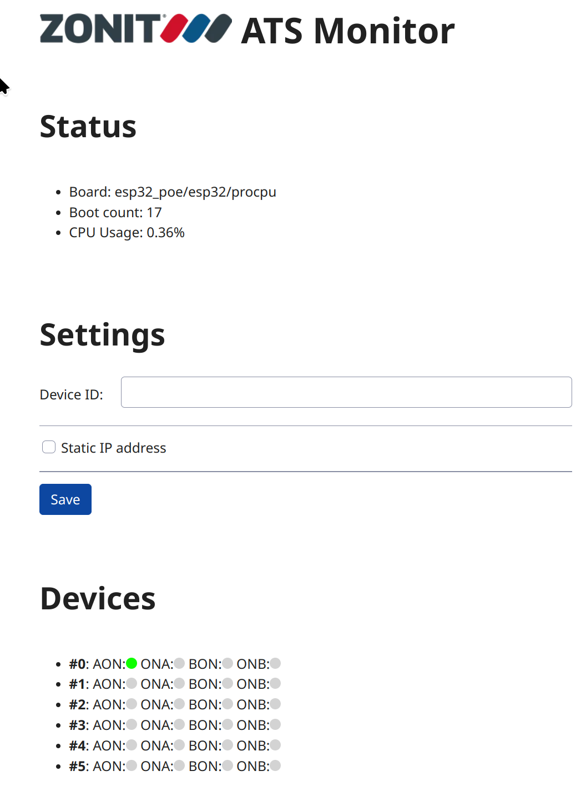
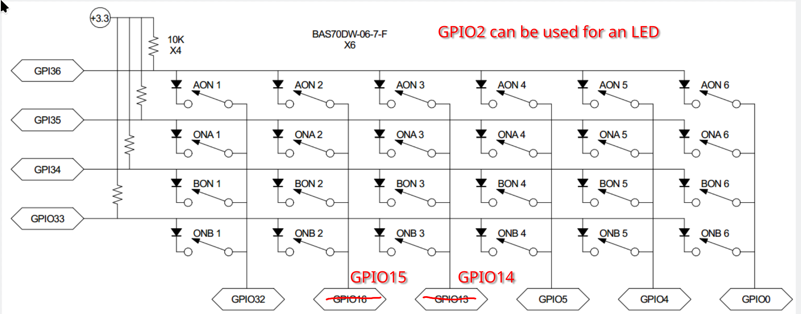

# Zonit Industrial Monitor Application

- [Product documentation](https://gitea.zonit.com/Zonit-Dev/product/src/branch/master/ats-industrial/monitor)

This application is meant to run on the ESP32-POE board from Olimex.

## Building/Flashing

In repo root directory:

- see top level
  [README-Zonit.md](https://gitea.zonit.com/Zonit-Dev/zephyr-zonit/src/branch/main/README-Zonit.md)
  for instructions on workspace setup.
- `. envsetup-zonit.sh`
- `z_build_industrial`
- `z_flash_industrial <serial port>`

## Operation

- open a serial console on the USB serial port
- connect an Ethernet cable
- the device will get an IP address via DHCP and display it in the serial
  console
- open a web page on the device IP address to see status
  http://device-ip-address/ -- example show below:



## Olimex Pin Mapping




### I2C Devices

#### 6-chan, Rev1

- IC1: MCP23018T-E/SO: 010 0111 0x20
- DS2484R+T: 0x18
- EMC2302-1-AIZL: 0x2E

## SNMP Testing

The Industrial monitor applications sends SNMP Traps when events occur.

### SNMP Test Server

#### net-snmp

Populate `/etc/snmp/snmptrapd.conf` with the following:

```
authCommunity log,execute,net public
disableAuthorization yes
```

`sudo snmptrapd -f -Lo`

#### Telegraf

This can be tested using
[Telegraf](https://www.influxdata.com/time-series-platform/telegraf/).

Steps:

- install Telegraf
- SNMP listens on port 162 by default, which is a priveleged port. On Linux you
  can do something like:
  `sudo setcap cap_net_bind_service=+ep /usr/bin/telegraf`
- run telegraf, run the following from this directory:
  `telegraf  --config test/telegraf.conf`

Now, Telegraf will print out any data it receives to `stdout`.

### Send a test trap

You can test a trap by:

- install: `net-snmp`
- run:
  `snmptrap -v 2c -c public localhost '' NET-SNMP-EXAMPLES-MIB::netSnmpExampleHeartbeatNotification netSnmpExampleHeartbeatRate i 123456`
