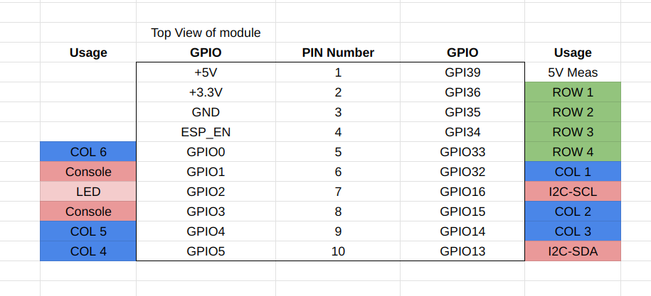

# Zonit Industrial Monitor Application

This application is meant to run on the ESP32-POE board from Olimex.

## Olimex Pin Mapping

## SNMP Testing

The Industrial monitor applications sends SNMP Traps when events occur.

### SNMP Test Server

This can be tested using
[Telegraf](https://www.influxdata.com/time-series-platform/telegraf/).

Steps:

- install Telegraf
- SNMP listens on port 162 by default, which is a priveleged port. On Linux you
  can do something like:
  `sudo setcap cap_net_bind_service=+ep /usr/bin/telegraf`
- run telegraf, run the following from this directory:
  `telegraf  --config test/telegraf.conf`

Now, Telegraf will print out any data it receives to `stdout`.

### Send a test trap

You can test a trap by:

- install: `net-snmp`
- run:
  `snmptrap -v 2c -c public localhost '' NET-SNMP-EXAMPLES-MIB::netSnmpExampleHeartbeatNotific│ │ation netSnmpExampleHeartbeatRate i 123456`
