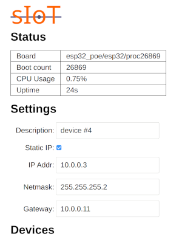

# Simple IoT Zephyr Networking Example

This application is an example of how to use the SIOT architecture for a network
connected MCU.

## Application architecture

The application is constructed of a number of threads that mostly read or write
points to a single
[zbus](https://docs.zephyrproject.org/latest/services/zbus/index.html) channel.
For example, the 1-wire thread may read a temperature sensor and publish a
temperature point. The web thread may publish this point to the web UI frontend
for display to the user. The fan control thread may also listen for temp points
and use them to control the fan speed. This architecture largely decouples
threads from each other. The 1-wire thread does not need to know the web and fan
control threads exist. The point type is what is used to determine where and how
data is used.

A point is a struct with the following fields:

| Field       | Type      | Description                                                                |
| ----------- | --------- | -------------------------------------------------------------------------- |
| `time`      | `uint64`  | nanoseconds since Unix epoch                                               |
| `type`      | `char[]`  | Point type                                                                 |
| `key`       | `char[]`  | Point key -- can be used for index to create arrays, or key to create maps |
| `data_type` | `uint8`   | Encoding of data field (currently float, int, or string)                   |
| `data`      | `uint8[]` | Data payload for point                                                     |

## Storing settings in flash

The Zephyr
[NVS subsystem](https://docs.zephyrproject.org/latest/services/storage/nvs/nvs.html)
is used to store settings in flash. If you want a point to be persisted in
flash, then add it to the table in `nvs_pts` table in `main.c`. This causes the
NVS thread to listen for this point type and store it in flash any time it sees
it. On boot, it will also read these points from flash and send them on the
points channel to configure the system with the saved settings.

## Web UI Frontend

The web UI for the project is a single-page application (SPA) written in Elm
that reads and writes JSON data to an HTTP API implemented in the Zephyr `web.c`
module.

[elm-land](https://elm.land/) comes with a development server that runs on your
workstation and updates the web page whenever it changes without losing state.
This is useful because you can do all of the web frontend develoment without
reflashing the Z-MR.

To run the development server: `siot_net_frontend_watch`

You will need to update the proxy field in
`apps/siot-net/frontend/elm-land.json` to match the IP address of your Z-MR
target system. (long term we'd like this to be an environment variable, but that
is not working yet)
