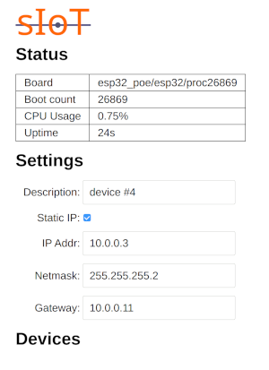

# Simple IoT Zephyr Networking Example

See also:

- [Zephyr Simple IoT Library](../../lib/README.md)

This application is an example of how to use the SIOT architecture for a network
connected MCU.



## Building

The web UI assets are compressed and embedded into the firmware binary at build
time, so the frontend must be built **before** the firmware. In a fresh
workspace this is a required first step:

```bash
siot_net_frontend_build              # generates apps/siot-net/frontend/dist/
siot_build_nucleo_h743zi apps/siot-net/
```

Substitute the appropriate `siot_build_<board>` command for your target (see the
build matrix in the [top-level CLAUDE.md](../../CLAUDE.md) or `envsetup.sh`).

Rebuild the frontend whenever you change anything under `frontend/` and want it
reflected in flashed firmware (the dev server below avoids reflashing during
frontend development).

## Web UI Frontend

The web UI for the project is a single-page application (SPA) written in Elm
that reads and writes JSON data to an HTTP API implemented in the Zephyr `web.c`
module.

[elm-land](https://elm.land/) comes with a development server that runs on your
workstation and updates the web page whenever it changes without losing state.
This is useful because you can do all of the web frontend develoment without
reflashing the Z-MR.

To run the development server: `siot_net_frontend_watch`

You will need to update the proxy field in
`apps/siot-net/frontend/elm-land.json` to match the IP address of your Z-MR
target system. (long term we'd like this to be an environment variable, but that
is not working yet)
