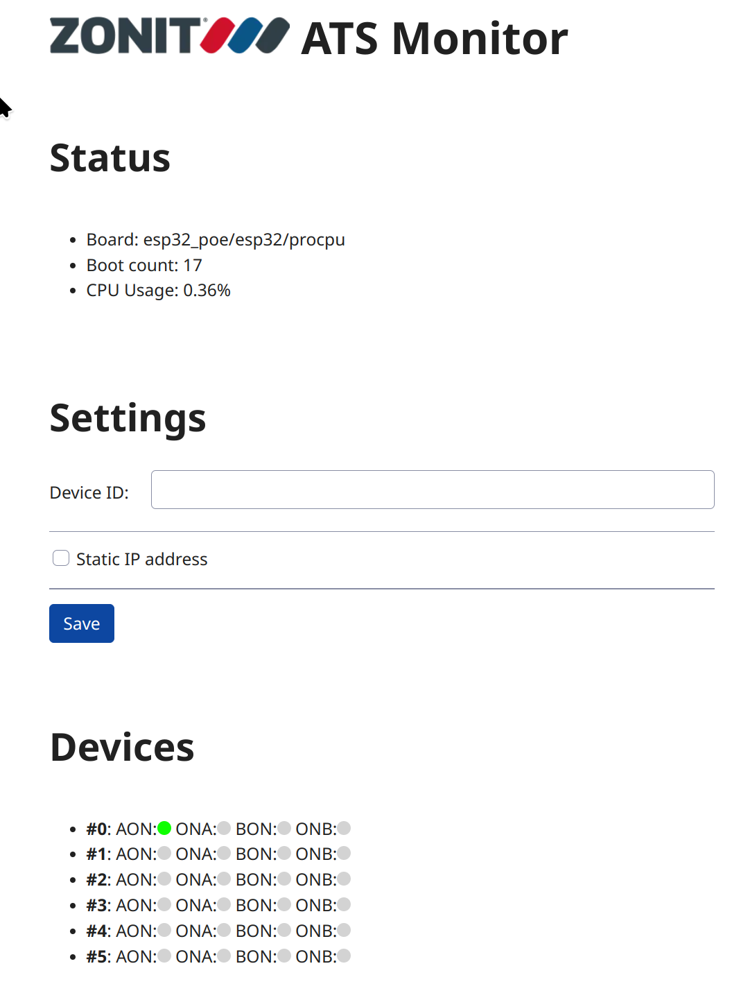
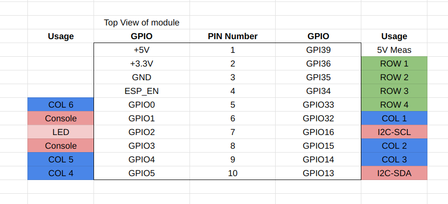

# Zonit M+R Zephyr Firmware

- [Product documentation](https://gitea.zonit.com/Zonit-Dev/product/src/branch/master/z-mr)

This application is meant to run on the ESP32-POE board from Olimex.

## Building/Flashing

In repo root directory:

- see top level
  [README-Zonit.md](https://gitea.zonit.com/Zonit-Dev/zephyr-zonit/src/branch/main/README-Zonit.md)
  for instructions on workspace setup.
- `. envsetup-zonit.sh`
- `z_build_zmr`
- `z_flash_zmr <serial port>`

## Operation

- open a serial console on the USB serial port
- connect an Ethernet cable
- the device will get an IP address via DHCP and display it in the serial
  console
- open a web page on the device IP address to see status
  http://device-ip-address/ -- example show below:



## Olimex Pin Mapping




### I2C Devices

#### 6-chan, Rev1

- DS2484R+T: `0x18`
- IC1: MCP23018T-E/SO: `0x20` (up to 8 IO-expanders can be added from `0x20` to
  `0x27`)
- EMC2302-1-AIZL: `0x2E`
- 8K EEProm: `0x50` to `0x57` (see
  [M+R product spec](https://gitea.zonit.com/Zonit-Dev/product/src/branch/master/mr/mr-product-spec.md#i2c-eeprom))
- RV-3028-C7 RTC: `0x82`

## SNMP

We are planning to port the
[LWIP SNMP](https://www.nongnu.org/lwip/2_1_x/group__snmp.html) code to Zephyr
([source code](https://github.com/lwip-tcpip/lwip/tree/master/src/apps/snmp)).
See
[this dicussion thread](https://github.com/zephyrproject-rtos/zephyr/discussions/80648).

The initial goal is to support SNMPv2c.

A public Zephyr module has been set up in this repo:

https://github.com/simpleiot/zephyr-snmp

This module is included in our build by adding it to
[`west.yml`](../../west.yml).

The SNMP library can be enabled by adding the following to `prj.conf`:

`CONFIG_LIB_SNMP=y`

It still needs ported and currently does not compile.

### SNMP Testing

The Industrial monitor applications sends SNMP Traps when events occur.

#### SNMP Test Server

##### net-snmp

Populate `/etc/snmp/snmptrapd.conf` with the following:

```
authCommunity log,execute,net public
disableAuthorization yes
```

`sudo snmptrapd -f -Lo`

##### Telegraf

This can be tested using
[Telegraf](https://www.influxdata.com/time-series-platform/telegraf/).

Steps:

- install Telegraf
- SNMP listens on port 162 by default, which is a priveleged port. On Linux you
  can do something like:
  `sudo setcap cap_net_bind_service=+ep /usr/bin/telegraf`
- run telegraf, run the following from this directory:
  `telegraf  --config test/telegraf.conf`

Now, Telegraf will print out any data it receives to `stdout`.

#### Send a test trap

You can test a trap by:

- install: `net-snmp`
- run:
  `snmptrap -v 2c -c public localhost '' NET-SNMP-EXAMPLES-MIB::netSnmpExampleHeartbeatNotification netSnmpExampleHeartbeatRate i 123456`
